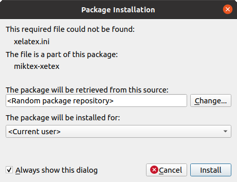

<h1 align="center">
  <br>
  
  <br>
  Hevs Latex Template Thesis
  <br>
</h1>

[](https://github.com/tschinz/hevs-latextemplate-thesis/blob/master/thesis.pdf) [](https://github.com/tschinz/hevs-latextemplate-thesis/raw/master/thesis.pdf)

A LaTeX template for the HES-SO//Valais Wallis Bachelor thesis.

> **Warning**
> Disclaimer, this is an unofficial latex template not supported by the HEI-Vs. Use at your own risk, no support is provided for installation or use. You have been warned.

# Table of contents

<p align="center">
  <a href="#features">Features</a> •
  <a href="#getting-started">Getting started</a> •
  <a href="#contributing">Contributing</a> •
  <a href="#credits">Credits</a> •
  <a href="#find-us-on">Find us on</a>
</p>

## Features

[(Back to top)](#table-of-contents)

* Title page with official layout
* Table of contents, Table of figures, Table of tables, Table of listings
* Abstract
* Nice title styles for chapter and appendices
* Chapter table of contents (minitoc)
* Bibliography
* Glossary
* Code highlighting with minted
* Nice default typography settings
* Optional watermark
* Optional linenumbering
* Optional comments
* Pifont icon package
* Awesome tip boxes
* Awesome font package
* Todo notes package
* Optional package for enable/disable of
   * Titlepage, Preface, Table of content, Table of figures, Table of tables, Table of listings, Appendices, Glossary, Acronyms, Bibliography, Watermark, Linenumbers, Comment

## Getting started

[(Back to top)](#table-of-contents)

### Installation

#### Windows

* Install [miniconda](https://repo.anaconda.com/miniconda/Miniconda3-latest-Windows-x86_64.exe) as **Just Me** and add to path: **C:\Users\my_account\AppData\Local\miniconda3\condabin**

* Install [MikTex](https://miktex.org/download)

* Install [make](http://gnuwin32.sourceforge.net/packages/make.htm)

* Install [perl](https://strawberryperl.com/releases.html) (for acronyms and glossaries support)

* Install [cmder](https://github.com/cmderdev/cmder/releases/latest) (for git)

* Open cmder and clone repo as well as create conda environment
  
  ```bash
  mkdir -p c:/work
  cd c:/work
  git clone https://github.com/tschinz/hevs-latextemplate-thesis.git
  cd hevs-latextemplate-thesis
  conda env create -f condaenv-win.yml
  ```

#### Linux

* Install base requirements
  
  ```bash
  sudo apt install git make
  ```

* Install [miniconda](https://docs.conda.io/en/latest/miniconda.html)
  
  ```bash
  # install miniconda
  mkdir -p ~/miniconda3
  wget https://repo.anaconda.com/miniconda/Miniconda3-latest-Linux-x86_64.sh -O ~/miniconda3/miniconda.sh
  bash ~/miniconda3/miniconda.sh -b -u -p ~/miniconda3
  rm -rf ~/miniconda3/miniconda.sh
  # if you have bash
  ~/miniconda3/bin/conda init bash
  # if you have zsh
  ~/miniconda3/bin/conda init zsh
  ```

* Install [MikTex](https://miktex.org/download) (check for your ubuntu release)
  
  ```bash
  sudo apt-key adv --keyserver hkp://keyserver.ubuntu.com:80 --recv-keys D6BC243565B2087BC3F897C9277A7293F59E4889
  echo "deb http://miktex.org/download/ubuntu focal universe" | sudo tee /etc/apt/sources.list.d/miktex.list
  sudo apt-get update
  sudo apt-get install miktex
  # open miktex console gui as admin (or via applications menu)
  sudo miktexsetup 
  ```

* Install python environment
  
  ```bash
  # clone repo
  mkdir -p ~/work
  cd ~/work
  git clone https://github.com/tschinz/hevs-latextemplate-thesis.git
  # install conda env environment
  cd hevs-latextemplate-thesis
  conda env create -f condaenv-linux.yml
  ```

* Open Makefile with your favorite editor
  
  ```bash
  vim ~/work/hevs-latextemplate-thesis/Makefile
  ```
  
  or
  
  ```bash
  nano ~/work/hevs-latextemplate-thesis/Makefile
  ```

* Comment and uncomment lines to set your shell
  
  ```
  ifeq ($(detected_OS),Linux)
    #SHELL = /bin/zsh
    SHELL = /bin/bash
    PDFVIEWER = xdg-open
    CONDA_ENV_FILE = condaenv-linux.yml
  ```

#### Mac

* Install base requirements
  
  ```bash
  # Install brew
  /bin/bash -c "$(curl -fsSL https://raw.githubusercontent.com/Homebrew/install/HEAD/install.sh)"
  brew install git make cask
  ```

* Install [miniconda](https://docs.conda.io/en/latest/miniconda.html)
  
  ```bash
  brew install --cask miniconda
  # if you have bash
  ~/miniconda3/bin/conda init bash
  # if you have zsh
  ~/miniconda3/bin/conda init zsh
  ```

* Install [MikTex](https://miktex.org/download) (check for macos release)

* Install python environment
  
  ```bash
  # clone repo
  mkdir -p ~/work
  cd ~/work
  git clone https://github.com/tschinz/hevs-latextemplate-thesis.git
  # install conda env environment
  cd hevs-latextemplate-thesis
  conda env create -f  condaenv-mac-arm64.yml
  ```

### How to use

1. Write your thesis

2. Use the given Makefile or your favorite IDE to build the PDF
   
   ```bash
   make help   # for more information
   make thesis # builds your thesis
   sudo make thesis # if you setted up miktex as admin in linux
   make clean  # cleans intermediate files
   ```
   
   During the first build, MixTex will install all required packages. Press ``install`` on all popups, or deselect the checkbox ``Always show this dialog`` on the bottom.
   
   
   
   ## Contributing
   
   [(Back to top)](#table-of-contents)

3. Take a look at the [issues](https://github.com/tschinz/hevs-latextemplate-thesis/issues) issues with the "Help wanted" tag

4. Choose something or open a new [issue](https://github.com/tschinz/hevs-latextemplate-thesis/issues)

5. Fork the repo, fix the problem in a branch

6. Rebase your branch if needed

7. Submit a [pull request](https://github.com/tschinz/hevs-latextemplate-thesis/pulls)

## Help

[(Back to top)](#table-of-contents)

[](https://github.com/tschinz/hevs-latextemplate-thesis/blob/master/guide-to-thesis.pdf) [](https://github.com/tschinz/hevs-latextemplate-thesis/raw/master/guide-to-thesis.pdf)

## Credits

[(Back to top)](#table-of-contents)

* Marc Demierre, for the extensions
* Loïc Monney, for the section title style, captions style and font idea
* EPFL, for the basic structure

## Find us on

[(Back to top)](#table-of-contents)

* Webpage [hevs.ch](https://www.hevs.ch)
* LinkedIn [HES-SO Valais-Wallis](https://www.linkedin.com/groups/104343/)
* Youtube [HES-SO Valais-Wallis](https://www.youtube.com/user/HESSOVS/)
* Twitter [@hessovalais](https://twitter.com/hessovalais)
* Facebook [@hessovalais](https://www.facebook.com/hessovalais)
